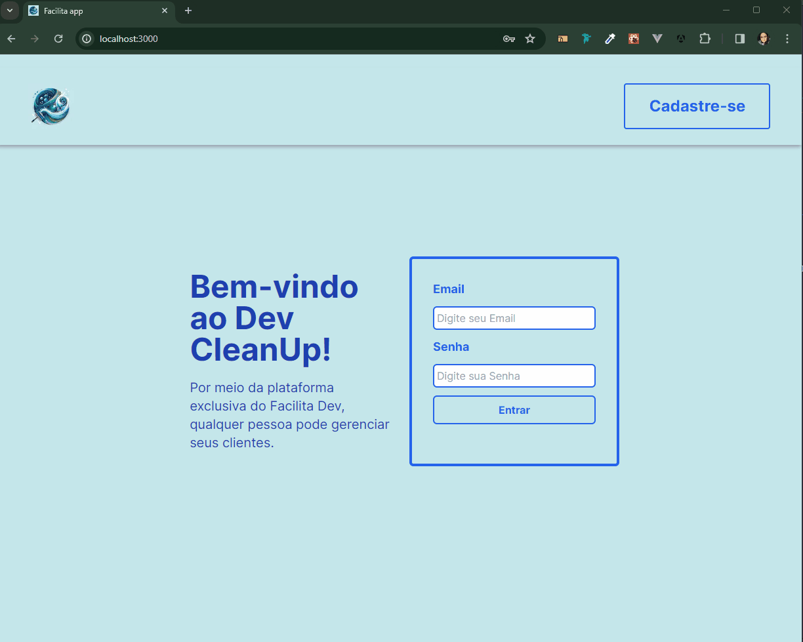
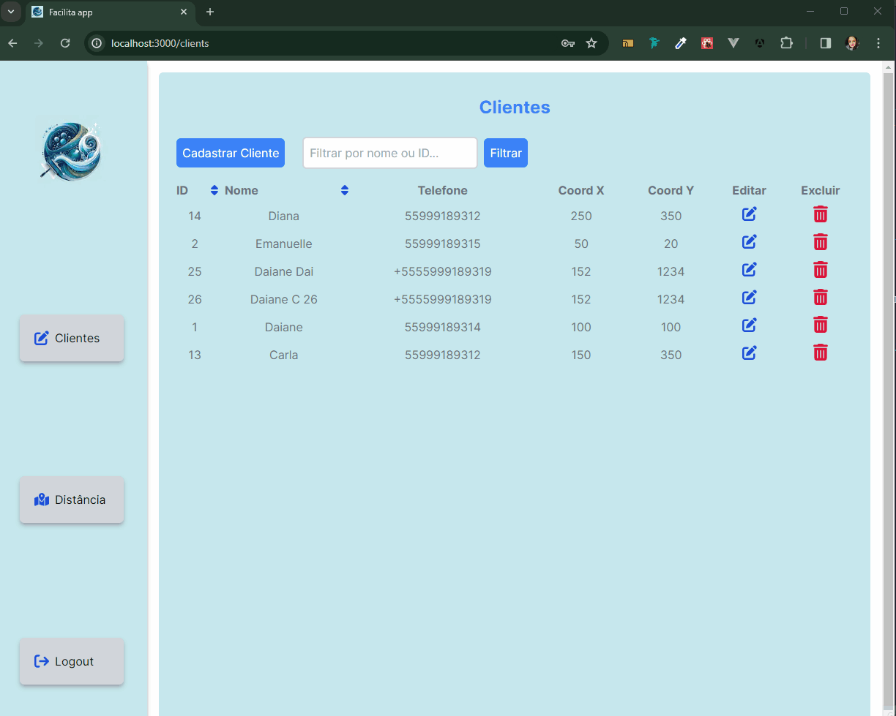
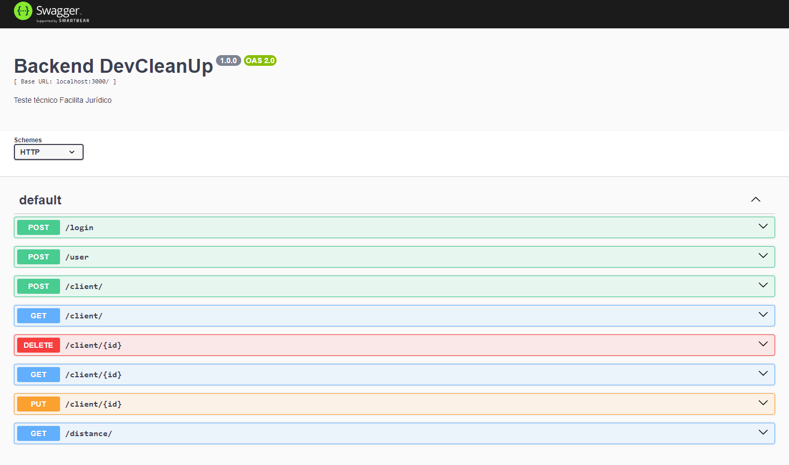

# Dev Clean Up

This project is a small system that allows users to control their clients and check the distance from the company to their houses.

The main page allows the user to register and login on the system, once the user is logged in, he can cread, read, update or delete a client. 
He also can see the distance between the company to the client's house and define a better route to get to the client based on that.

This project was developed with the following dependencies and versions:

## Frontend

| Dependency      | Version |
| --------------- | ------- |
| axios           | 1.6.5   |
| jwt-decode      | 4.0.0   |
| next            | 14.1.0  |
| react           | 18      |
| react-dom       | 18      |
| react-hook-form | 7.49.3  |

| Dev Dependency     | Version |
| ------------------ | ------- |
| @types/node        | 20      |
| @types/react       | 18      |
| @types/react-dom   | 18      |
| autoprefixer       | 10.0.1  |
| eslint             | 8       |
| eslint-config-next | 14.1.0  |
| postcss            | 8       |
| tailwindcss        | 3.3.0   |
| typescript         | 5       |

## Backend

This is an API building with Express aiming to control clients in a system.

| Dependency         | Version |
| ------------------ | ------- |
| bcrypt             | 5.1.1   |
| cors               | 2.8.5   |
| dotenv             | 16.4.1  |
| express            | 4.18.2  |
| jsonwebtoken       | 9.0.2   |
| pg                 | 8.11.3  |
| swagger-autogen    | 2.23.7  |
| swagger-ui-express | 5.0.0   |

**Dev Dependencies**

| Dependency | Version |
| ---------- | ------- |
| nodemon    | 3.0.3   |
## Getting Started

1 - Clone the project:

The Git of the project used 2 submodules (frontend and backend) which allow to create the projects separated in other git repositories and add them together on the main repository but it also require to use additional commnand when clonning it.

You can read more about git submodules here: https://git-scm.com/book/en/v2/Git-Tools-Submodules

You can use this CLI command on your terminal:

```bash
git clone --recurse-submodules https://github.com/Daaaiii/devCleanUp.git
```

If you already clonned the repository without using the --recurse-submodules, you can use the command bellow to update it: 
```bash
git submodule update --init --recursive.
```

2 - Install the dependencies on each project separatedly:

```bash
npm install
# or
yarn install
# or
pnpm install
# or
bun install
```

3 - Run the development server on each project separatedly:

```bash
npm run dev
# or
yarn dev
# or
pnpm dev
# or
bun dev
```
4 - Swagger documentation of API
 The api has an script to generate Swagger automatically once the api starts.

Open [http://localhost:3001/doc](http://localhost:3001/doc) with your browser to see the documentation of the api and all the endpoints available .

## The Project

The project presents a frontend and a backend. Make sure both projects are running to allow them to work together.

Run each project separatedly, one at http://localhost:3000 and the other at http://localhost:3001 (backend). This will allow you to use the full project.
1 - First create an user or log in in the system


2 - Once you log at the system, you can see the clients list, edit clients, delete clients and order by id or by name.
You can also check the 'Distância' button that will open a page where you can see the distance between the company and the client's house.


If you only want check the API, you can check http://localhost:3001/doc, it will open the Swagger documentation.


## Stay in touch

<table>
  <tr>
    <td align="center">
      <a href="https://www.linkedin.com/in/daiane-deponti-bolzan/">
        <br>
        <sub>
          <b>Daiane Bolzan</b>
        </sub>
      </a>
    </td>
  </tr>
</table>


## License

[MIT licensed](LICENSE)